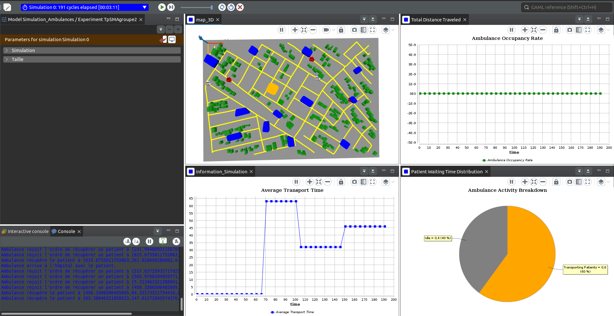

# Simulation des Ambulances dans une Ville

## Description du Projet

Ce projet vise à modéliser et simuler le fonctionnement des services d’ambulance dans un environnement urbain. Il s’agit d’une approche basée sur la simulation pour analyser les défis et optimiser les temps de réponse des services d’urgence. La simulation incorpore des éléments tels que le réseau routier, les conditions de trafic, les patients, et les hôpitaux.

### Les principales fonctionnalités incluent :
- Création d’un fichier GIS basé sur des données OpenStreetMap.
- Simulation des itinéraires des ambulances avec des conditions de trafic dynamiques.
- Analyse des performances du système d’urgence pour différents scénarios.

### Objectifs
1. Évaluation Comparative : Identifier les meilleures pratiques et défis spécifiques des itinéraires d’ambulance.
2. Optimisation : Proposer des stratégies pour réduire les temps de réponse et améliorer l’efficacité.
3. Analyse de l’Impact du Trafic : Comprendre comment les variations de trafic affectent les interventions.

### Méthodologie
1. Cartographie avec QGIS : Création du réseau routier et délimitation de la zone d’étude en utilisant OpenStreetMap.
2. Simulation avec GAMA : Modélisation des interactions entre ambulances, patients, hôpitaux et trafic dans l’environnement urbain.
3. Analyse des Résultats : Mesure des performances des ambulances, du temps de transport et des taux d’occupation.

### Architecture du Modèle

Le projet repose sur une architecture à base d’agents. Voici les agents principaux :
- Ambulance : Déplacement pour récupérer et transporter les patients.
- Patient : Attente et interaction avec les ambulances.
- Route : Modélisation des trajets et des conditions de circulation.
- Hôpital : Destination pour les patients transportés.
- Centre de Contrôle : Gestion des missions et optimisation des itinéraires.

### Résultats Clés
1. Temps de réponse optimisé pour la majorité des interventions.
2. Visualisation des itinéraires d’ambulances sur une carte 3D.
3. Analyse des périodes de forte demande et des congestions routières.

### Outils Utilisés
- QGIS : Préparation et gestion des données géospatiales.
- GAMA Platform : Modélisation et simulation des systèmes multi-agents.

### Comment Exécuter le Projet

- Pré-requis
   - Installer QGIS.
   - Installer GAMA.

- Étapes
1. Ouvrir le fichier GIS dans QGIS pour visualiser les données spatiales.
2. Importer les fichiers shapefiles dans GAMA.
3. Lancer le modèle GAMA et exécuter la simulation.

- Auteurs
  - BIABA KUYA Jirince
  - BYAOMBE MWINDULWA Dieudonné
  - TOUMBA NGONGO Christine
  
### Sous la direction de Prof. Manh Hung Nguyen

